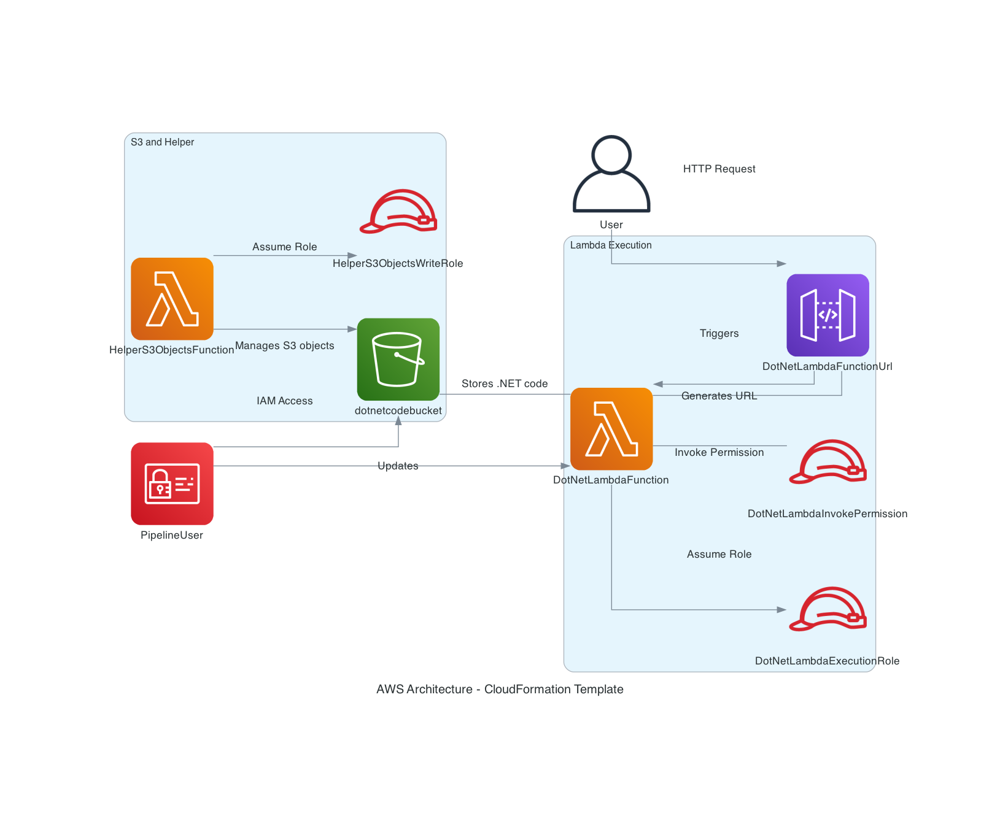

## Table of Contents

1. [Step-01: Prerequisites](#step-01-prerequisites)
2. [Step-02: Deploy CloudFormation Stack for Code](#step-02-deploy-cloudformation-stack-for-code)
3. [Step-03: Create AWS IAM User for Pipeline](#step-03-create-aws-iam-user-for-pipeline)
4. [Step-04: Add Secrets to GitHub Secrets](#step-04-add-secrets-to-github-secrets)
5. [Step-05: Delete CloudFormation Stack](#step-05-delete-cloudformation-stack)
6. [Step-06: Delete AWS IAM User for Pipeline](#step-06-delete-aws-iam-user-for-pipeline)

## Architecture



### User Interaction
- A user sends an HTTP request to the Lambda function URL (`DotNetLambdaFunctionUrl`).

### Lambda Function
- The `DotNetLambdaFunction` handles the HTTP request. It assumes the `DotNetLambdaExecutionRole` IAM role to gain the necessary permissions.
- It generates a URL and interacts with an S3 bucket (`dotnetcodebucket`), which stores .NET code.

### S3 and Helper Lambda
- The S3 bucket (`dotnetcodebucket`) stores the .NET code.
- A helper Lambda function (`HelperS3ObjectsFunction`) manages S3 objects within this bucket, such as creating and deleting objects.
- The helper Lambda function assumes the `HelperS3ObjectsWriteRole` IAM role to manage these S3 operations.

### IAM Roles
- `DotNetLambdaExecutionRole`: Provides the necessary permissions for the primary Lambda function.
- `HelperS3ObjectsWriteRole`: Provides permissions for the helper Lambda function to manage S3 objects.

### Pipeline User for GitHub Actions
- An IAM user (`PipelineUser`) is used in the GitHub Actions workflow for deploying updates to the Lambda function and uploading the packaged code to the S3 bucket.
- The workflow includes steps for checking out the code, setting up .NET, installing dependencies, building the project, zipping the Lambda package, configuring AWS credentials, uploading the package to S3, and updating the Lambda function code.

### Flow
- **User** -> **Lambda Function URL** -> **Lambda Function** -> **S3 Bucket**
- **Helper Lambda** -> **S3 Bucket** (for management tasks)
- **Pipeline User** -> **GitHub Actions** -> **S3 Bucket and Lambda Function** (for deployment)

### Clarifications
- The `App.config` file was removed because AWS Lambda does not support it. For more information, refer to the following links:
  - [GitHub Issue: AWS Lambda .NET support for App.config](https://github.com/aws/aws-lambda-dotnet/issues/230)
  - [StackOverflow: App.config in an AWS Lambda function](https://stackoverflow.com/questions/46879797/app-config-in-an-aws-lambda-function)

This architecture ensures that the .NET code is stored securely in an S3 bucket, managed by a helper Lambda function, and updated via a CI/CD pipeline using GitHub Actions with the appropriate permissions.


## Step-01: Prerequisites

Before proceeding, ensure that you have the AWS CLI and jq installed on your local machine.

#### Install AWS CLI

Follow the instructions provided by AWS to install the AWS CLI on your operating
system: [Install the AWS CLI](https://docs.aws.amazon.com/cli/latest/userguide/getting-started-install.html).

After installing the AWS CLI, configure it using:

```bash
aws configure
```

#### Install jq

Follow the instructions to install jq on your operating system from the official jq
website: [Install jq](https://github.com/jqlang/jq).

## Step-02: Deploy CloudFormation Stack for Code

```bash
export S3_BUCKET_PREFIX=my-name-is-pepe
export STACK_NAME=aws-dotnet-serverless-stack

aws cloudformation deploy \
    --stack-name $STACK_NAME \
    --template-file etc/cloudformation-template.yaml \
    --parameter-overrides S3BucketPrefix=$S3_BUCKET_PREFIX \
    --capabilities CAPABILITY_NAMED_IAM \
    --region us-east-1
```

## Step-03: Create AWS IAM User for Pipeline

```bash  
# Set user name
export USER_NAME="dotnetpipeline"

# Create IAM user
aws iam create-user --user-name $USER_NAME

# Create access keys for the user
ACCESS_KEYS=$(aws iam create-access-key --user-name $USER_NAME)

# Extract AccessKeyId and SecretAccessKey
ACCESS_KEY_ID=$(echo $ACCESS_KEYS | jq -r '.AccessKey.AccessKeyId')
SECRET_ACCESS_KEY=$(echo $ACCESS_KEYS | jq -r '.AccessKey.SecretAccessKey')

# Attach necessary policies
# ⚠️ THIS IS NOT PRODUCTION READY - USE A LEAST PRIVILEGE ROLE INSTEAD
aws iam attach-user-policy --user-name $USER_NAME --policy-arn arn:aws:iam::aws:policy/AmazonS3FullAccess
aws iam attach-user-policy --user-name $USER_NAME --policy-arn arn:aws:iam::aws:policy/AWSLambda_FullAccess

# ⚠️ Output the Access Key details
echo "Access Key ID: $ACCESS_KEY_ID"
echo "Secret Access Key: $SECRET_ACCESS_KEY"
```

### Step-04: Add Secrets to GitHub Secrets

After creating the IAM user and generating the access keys, follow these steps to add these credentials to your GitHub
repository secrets for use in GitHub Actions:

1. **Navigate to Your GitHub Repository**:
    - Go to the main page of your repository on GitHub.

2. **Access Repository Settings**:
    - Click on the **Settings** tab at the top of the repository page.

3. **Navigate to Secrets**:
    - In the left sidebar, click on **Secrets and variables** > **Actions**.

4. **Add New Repository Secret**:
    - Click the **New repository secret** button.

5. **Add Secrets**:
    - **AWS_ACCESS_KEY_ID**:
        - **Name**: `AWS_ACCESS_KEY_ID`
        - **Value**: Enter the `AccessKeyId` value you obtained.
        - Click **Add secret**.
    - **AWS_SECRET_ACCESS_KEY**:
        - **Name**: `AWS_SECRET_ACCESS_KEY`
        - **Value**: Enter the `SecretAccessKey` value you obtained.
        - Click **Add secret**.
    - **S3_BUCKET_PREFIX**:
        - **Name**: `S3_BUCKET_PREFIX`
        - **Value**: Enter your S3 bucket prefix (e.g., `my-name-is-pepe`).
        - Click **Add secret**.

By following these steps, you'll securely add the necessary credentials to your GitHub repository for use in your GitHub
Actions workflow.

## Step-05: Delete CloudFormation Stack

To delete the CloudFormation stack, use the following command:

```bash
# Set the stack name
export STACK_NAME="aws-dotnet-serverless-stack"

# Delete the CloudFormation stack
aws cloudformation delete-stack --stack-name $STACK_NAME

# Wait for the stack to be deleted
aws cloudformation wait stack-delete-complete --stack-name $STACK_NAME
```

## Step-06: Delete AWS IAM User for Pipeline

To delete the IAM user created for the pipeline, use the following commands:

```bash
# Delete the IAM user (this will also delete the associated access keys and policies)
aws iam delete-user --user-name $USER_NAME
```
